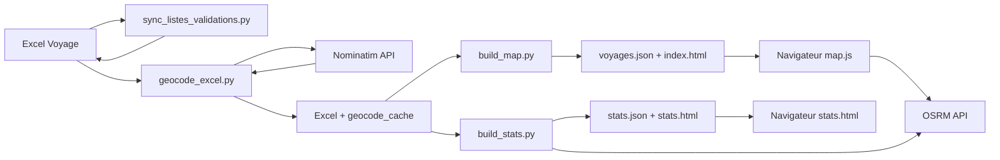

# CarteVoyage — Cahier des charges

**Version :** 2.0  
**Date :** 11 juin 2026  
**Projet :** CarteVoyage — Carte interactive et statistiques de voyage à partir d'un fichier Excel

**Site en ligne :** [https://sinnamary.github.io/CarteVoyage/web/](https://sinnamary.github.io/CarteVoyage/web/)

---

## Table des matières

1. [Présentation générale](#1-présentation-générale)
2. [Contexte et objectifs](#2-contexte-et-objectifs)
3. [Périmètre fonctionnel](#3-périmètre-fonctionnel)
4. [Acteurs et utilisateurs](#4-acteurs-et-utilisateurs)
5. [Source de données — Fichier Excel](#5-source-de-données--fichier-excel)
6. [Pipeline de traitement des données](#6-pipeline-de-traitement-des-données)
7. [Application web — Carte interactive](#7-application-web--carte-interactive)
8. [Application web — Statistiques](#8-application-web--statistiques)
9. [Modèle de données JSON](#9-modèle-de-données-json)
10. [Architecture technique](#10-architecture-technique)
11. [Structure du projet](#11-structure-du-projet)
12. [Guide d'utilisation](#12-guide-dutilisation)
13. [Publication sur GitHub Pages](#13-publication-sur-github-pages)
14. [Critères d'acceptation](#14-critères-dacceptation)
15. [Contraintes, limites et risques](#15-contraintes-limites-et-risques)
16. [Évolutions envisageables](#16-évolutions-envisageables)

---

## 1. Présentation générale

**CarteVoyage** est un outil personnel de planification et de visualisation de voyages. Il transforme un fichier Excel de planning (activités, musées, balades, transports, repas…) en :

- une **carte web interactive** affichant les points géolocalisés, organisés par jour, avec calcul des **trajets à pied ou en voiture** entre visites consécutives ;
- une **page de statistiques** (distances, durées, budget, répartition par jour et par ville).

Le projet repose sur une chaîne simple :

```
Excel (source) → Scripts Python (sync, géocodage, build, stats) → JSON + HTML statique → Navigateur (Leaflet)
```

Il n'y a **pas de serveur applicatif** : le site web est entièrement statique et peut être ouvert localement ou hébergé sur GitHub Pages (ou tout hébergeur de fichiers statiques).

**Voyage de référence :** Strasbourg → Cologne → Amsterdam → Lille (12 jours, août 2026).

---

## 2. Contexte et objectifs

### 2.1 Contexte

L'utilisateur planifie un voyage multi-villes dans un tableur Excel structuré par feuilles et colonnes. Il souhaite :

- Visualiser géographiquement l'ensemble des lieux à visiter ;
- Filtrer par jour pour se concentrer sur un itinéraire donné ;
- Estimer les déplacements à pied (en ville) ou en voiture (changement de ville, transport, longues distances) ;
- Consulter les informations pratiques (horaires, prix, billets, quartier) directement sur la carte ;
- Avoir une vue synthétique des distances parcourues et du budget.

### 2.2 Objectifs

| Objectif | Description |
|----------|-------------|
| **Centraliser** | Une seule source de vérité : le fichier Excel |
| **Automatiser** | Géocoder automatiquement les lieux, générer carte et statistiques |
| **Visualiser** | Carte claire, numérotée, colorée par jour |
| **Naviguer** | Filtres par jour, liste des visites, trajets piétons/voiture |
| **Analyser** | Statistiques agrégées (distances, budget, répartitions) |
| **Rester simple** | Pas de base de données, pas de backend, déploiement minimal |

### 2.3 Hors périmètre

- Édition en ligne du planning (lecture seule côté web)
- Authentification / multi-utilisateurs
- Application mobile native
- Calcul d'itinéraires multimodaux (transports en commun, vélo)
- Synchronisation temps réel avec Excel

---

## 3. Périmètre fonctionnel

### 3.1 Fonctionnalités — Scripts Python

#### F1 — Géocodage automatique (`geocode_excel.py`)

| ID | Exigence | Priorité |
|----|----------|----------|
| F1.1 | Lire toutes les feuilles `Jour N` du fichier Excel | Obligatoire |
| F1.2 | Créer automatiquement les colonnes `Latitude`, `Longitude`, `Lien` si absentes | Obligatoire |
| F1.3 | Géocoder via Nominatim (OpenStreetMap), pays déduit de la colonne `Ville` (`COUNTRY_BY_VILLE`) | Obligatoire |
| F1.4 | Respecter un délai de 1,1 s entre requêtes (politique Nominatim) | Obligatoire |
| F1.5 | Utiliser un cache local (`data/geocode_cache.json`) | Obligatoire |
| F1.6 | Appliquer des alias de noms (`NAME_ALIASES`, `NOM_ALIASES_BY_VILLE`) | Obligatoire |
| F1.7 | Permettre des coordonnées manuelles (`MANUAL_COORDS`) | Obligatoire |
| F1.8 | Pour les balades, utiliser la colonne `Quartier` (interne `Remarque`) comme requête prioritaire | Obligatoire |
| F1.9 | Ignorer les lignes déjà géocodées (sauf `--force`) | Obligatoire |
| F1.10 | Ignorer les lignes « Trajet … » et « Retour … » (logistique sans point carte) | Obligatoire |
| F1.11 | Renommer automatiquement les lieux ambigus (`EXCEL_LIEU_RENAMES`) et compléter les villes manquantes | Obligatoire |
| F1.12 | Créer une sauvegarde Excel avant modification (`excel/backups/`) | Obligatoire |
| F1.13 | Produire un rapport d'erreurs (`data/geocode_errors.csv`) | Obligatoire |
| F1.14 | Mode simulation `--dry-run` sans écriture dans Excel | Souhaité |

**Pays supportés (via `COUNTRY_BY_VILLE`) :** Pays-Bas (`nl`), Allemagne (`de`), France (`fr`), avec défaut `nl`.

#### F2 — Génération de la carte (`build_map.py`)

| ID | Exigence | Priorité |
|----|----------|----------|
| F2.1 | Extraire les points ayant des coordonnées valides | Obligatoire |
| F2.2 | Ignorer les lignes sans `N° étape` valide (format `jour.visite`) | Obligatoire |
| F2.3 | Signaler les collisions d'ordre et les labels dupliqués | Obligatoire |
| F2.4 | Générer `data/voyages.json` | Obligatoire |
| F2.5 | Générer `web/index.html` avec `window.VOYAGE_DATA` embarqué et en-tête de navigation | Obligatoire |
| F2.6 | Produire `data/lignes_sans_coords.csv` | Obligatoire |
| F2.7 | Attribuer une couleur par jour (palette cyclique de 10 couleurs) | Obligatoire |
| F2.8 | Inclure `ville` et métadonnées popup (Nature, Catégorie, Réservation, Prix, horaires, Quartier) | Obligatoire |

#### F3 — Statistiques du voyage (`build_stats.py`)

| ID | Exigence | Priorité |
|----|----------|----------|
| F3.1 | Calculer les segments entre visites consécutives du même jour | Obligatoire |
| F3.2 | Déterminer le mode de déplacement (pied / voiture) selon les mêmes règles que la carte | Obligatoire |
| F3.3 | Interroger OSRM pour distances et durées (cache `data/route_stats_cache.json`) | Obligatoire |
| F3.4 | Fallback distance à vol d'oiseau si OSRM indisponible (`--no-osrm` pour tout désactiver) | Obligatoire |
| F3.5 | Agréger par jour, par ville, par nature, par catégorie, par réservation | Obligatoire |
| F3.6 | Calculer le budget (prix renseignés, total visites) | Obligatoire |
| F3.7 | Générer `data/stats.json` et `web/stats.html` | Obligatoire |

#### F4 — Synchronisation des listes déroulantes (`sync_listes_validations.py`)

| ID | Exigence | Priorité |
|----|----------|----------|
| F4.1 | Recalculer les plages de la feuille masquée `Listes` (colonnes A–E) | Obligatoire |
| F4.2 | Mettre à jour les validations des feuilles `Jour N` pour pointer vers les bonnes plages | Obligatoire |
| F4.3 | Sauvegarder Excel avant écriture ; mode `--dry-run` | Obligatoire |

#### F5 — Vérification du classeur (`verify_planning_workbook.py`)

| ID | Exigence | Priorité |
|----|----------|----------|
| F5.1 | Vérifier la structure des feuilles (`Vue d'ensemble`, `Listes`, `Jour 1`…`Jour 12`) | Obligatoire |
| F5.2 | Contrôler les colonnes requises du planning et la présence de Latitude/Longitude | Obligatoire |
| F5.3 | Détecter les listes déroulantes désynchronisées | Obligatoire |
| F5.4 | Signaler collisions d'ordre, labels dupliqués, format texte pour `.10` | Obligatoire |
| F5.5 | Vérifier les marqueurs attendus dans la vue d'ensemble | Souhaité |
| F5.6 | Code de sortie 1 en cas d'erreur bloquante | Obligatoire |

### 3.2 Fonctionnalités — Application web

#### F6 — Carte principale (`web/index.html` + `map.js`)

| ID | Exigence | Priorité |
|----|----------|----------|
| F6.1 | Carte Leaflet avec tuiles OpenStreetMap | Obligatoire |
| F6.2 | Marqueur numéroté par point (`ordre_label`, ex. `3.5`), coloré par jour | Obligatoire |
| F6.3 | Popup détaillée : nom, jour/visite, nature, catégorie, horaires, prix, billet, quartier, lien site | Obligatoire |
| F6.4 | Navigation précédent/suivant dans la popup (visites du même jour) | Obligatoire |
| F6.5 | Décalage des marqueurs aux coordonnées identiques | Obligatoire |
| F6.6 | Filtre par jour (cases à cocher) | Obligatoire |
| F6.7 | Liste des visites cliquable pour centrer la carte | Obligatoire |
| F6.8 | Option « Centrer sur les activités du jour » (masque trajets voiture et points transport inter-villes) | Obligatoire |
| F6.9 | Bouton « Tout afficher » | Obligatoire |
| F6.10 | Interface responsive (panneau filtres repliable ≤ 768 px) | Obligatoire |
| F6.11 | Persistance de l'état des filtres dans l'URL (`#j=…&t=…&c=0`) | Souhaité |

#### F7 — Trajets sur la carte

| ID | Exigence | Priorité |
|----|----------|----------|
| F7.1 | Segments entre visites consécutives **du même jour** | Obligatoire |
| F7.2 | Mode automatique : **à pied** en ville, **voiture** si transport, changement de ville ou > 5 km à vol d'oiseau | Obligatoire |
| F7.3 | Calcul OSRM piéton et voiture (serveurs DE puis Project OSRM) | Obligatoire |
| F7.4 | Distance et durée dans la popup du trajet | Obligatoire |
| F7.5 | Couleur distincte par trajet ; regroupement par jour avec « Tout cocher / Tout décocher » | Obligatoire |
| F7.6 | Fallback ligne droite pointillée si OSRM indisponible | Obligatoire |
| F7.7 | Cache côté client ; requêtes concurrentes limitées (3) | Obligatoire |
| F7.8 | Bouton « Effacer les trajets » | Obligatoire |
| F7.9 | Désactivation des trajets dont un point est masqué par les filtres | Obligatoire |

#### F8 — Page statistiques (`web/stats.html`)

| ID | Exigence | Priorité |
|----|----------|----------|
| F8.1 | Cartes récapitulatives (jours, activités, distances pied/voiture, budget) | Obligatoire |
| F8.2 | Points saillants (plus long segment pied/voiture, jour le plus marché) | Obligatoire |
| F8.3 | Tableaux par jour, par ville, segments détaillés | Obligatoire |
| F8.4 | Graphiques en barres (nature, catégorie, réservations) | Obligatoire |
| F8.5 | Liste des trajets logistiques et lieux sans coordonnées | Obligatoire |
| F8.6 | Navigation commune avec la carte (en-tête partagé) | Obligatoire |

---

## 4. Acteurs et utilisateurs

| Acteur | Rôle |
|--------|------|
| **Planificateur** | Maintient le fichier Excel, lance les scripts (sync, géocodage, build, stats, vérification) |
| **Voyageur** | Consulte la carte et les statistiques dans un navigateur (desktop ou mobile) |
| **Services externes** | Nominatim (géocodage), OSRM (routage pied/voiture), OpenStreetMap (tuiles) |

---

## 5. Source de données — Fichier Excel

### 5.1 Emplacement

- Dossier : `excel/`
- Fichier par défaut : `excel/Voyage Aout 2026.xlsx`
- Sauvegardes automatiques : `excel/backups/Voyage Aout 2026.backup.xlsx`
- **Non versionné** (`.gitignore` : `*.xlsx`) — fichier local ou personnel

### 5.2 Structure des feuilles

| Type de feuille | Exemple | Traitement |
|-----------------|---------|------------|
| **Vue d'ensemble** | `Vue d'ensemble` | Ignorée (synthèse du voyage) |
| **Listes** | `Listes` | Feuille masquée — listes déroulantes (colonnes A–E) |
| **Jours** | `Jour 1` … `Jour 12` | Lues et traitées |

Chaque feuille `Jour N` a une bannière en ligne 1, les en-têtes en ligne 2, les activités à partir de la ligne 3.

Structure attendue par `verify_planning_workbook.py` :

```
Vue d'ensemble, Listes, Jour 1, Jour 2, …, Jour 12
```

### 5.3 Colonnes du planning

Mapping interne (`PLANNING_COLUMNS` dans `excel_utils.py`) :

| Colonne Excel | Clé interne | Obligatoire | Description |
|---------------|-------------|-------------|-------------|
| `N° étape` | `Ordre` | **Oui** | Jour et numéro de visite (`3.5`, `5.10` en **texte**) |
| `Lieu` | `Nom` | **Oui** | Nom du lieu |
| `Nature` | `Action` | Non | Visite, Transport, Balade, Repas… |
| `Catégorie` | `Type` | Non | Musée, Restaurant, Route… |
| `Quartier` | `Remarque` | Non | Quartier (aide géocodage des balades) |
| `Ville` | `Ville` | Non | Détermine le pays pour le géocodage |
| `Réservation` | `Billet` | Non | Oui / Non / À faire |
| `Prix (€)` | `Prix` | Non | Prix en euros |
| `Heure début` / `Heure fin` | `Ouverture` / `Fermeture` | Non | Horaires |
| `Site web` | `Site` | Non | URL |

Lignes ignorées : `Lieu` vide, « Journée à planifier », sans `N° étape` valide.

#### Colonnes carte (créées automatiquement)

| Colonne | Description |
|---------|-------------|
| `Latitude` / `Longitude` | Coordonnées WGS84 |
| `Lien` | URL prioritaire pour le popup (sinon `Site web`) |

### 5.4 Règles de parsing du `N° étape`

- Format : `jour.visite` (ex. `6.5`, `3.10`)
- Séparateur `.` ou `,` accepté
- Saisir en **format texte** (`@`) les étapes contenant `.10` pour éviter `5.10` → `5.1`
- Lignes « Trajet … » / « Retour … » : pas de géocodage, comptées comme trajets logistiques dans les stats

### 5.5 Feuille Listes et validations

La feuille `Listes` (masquée) alimente les listes déroulantes des feuilles jour. Lorsque des valeurs sont ajoutées ou supprimées, lancer :

```bash
python scripts/sync_listes_validations.py
```

Le script recalcule les plages `Listes!$A$2:$A$N` … `Listes!$E$2:$E$N` et met à jour les validations Excel.

---

## 6. Pipeline de traitement des données

### 6.1 Schéma du flux



### 6.2 Script `geocode_excel.py`

**Algorithme (par lieu) :**

1. Ignorer si « Trajet … » / « Retour … »
2. Ignorer si déjà géocodé (sauf `--force`)
3. Coordonnées manuelles (`MANUAL_COORDS`)
4. Cache (`pays|nom|quartier`)
5. Requêtes Nominatim :
   - Balade + quartier → `{quartier}, {ville}`
   - Nom (avec alias)
   - `{nom}, {quartier}` si quartier non générique
   - `{nom}, {ville}`
6. Pays via `country_for_ville(ville)` (`COUNTRY_BY_VILLE`, défaut `nl`)

**Commandes :**

```bash
python scripts/geocode_excel.py
python scripts/geocode_excel.py "excel/MonVoyage.xlsx"
python scripts/geocode_excel.py --dry-run
python scripts/geocode_excel.py --force
```

**Fichiers produits :** `data/geocode_cache.json`, `data/geocode_errors.csv`, `excel/backups/*.backup.xlsx`

### 6.3 Script `build_map.py`

```bash
python scripts/build_map.py
python scripts/build_map.py "excel/MonVoyage.xlsx"
```

**Fichiers produits :** `data/voyages.json`, `web/index.html`, `data/lignes_sans_coords.csv`

### 6.4 Script `build_stats.py`

```bash
python scripts/build_stats.py
python scripts/build_stats.py --no-osrm    # distances à vol d'oiseau uniquement
```

**Fichiers produits :** `data/stats.json`, `data/route_stats_cache.json`, `web/stats.html`

**Règle mode de déplacement (identique à la carte) :**

- `car` si Nature = Transport, ou villes différentes, ou distance > 5 km
- `foot` sinon

### 6.5 Script `verify_planning_workbook.py`

```bash
python scripts/verify_planning_workbook.py
```

Contrôle structure, colonnes, validations, collisions. Code de sortie 1 si erreur bloquante.

### 6.6 Workflow recommandé

```bash
# 1. Environnement Python
cd CarteVoyage
python -m venv .venv
.venv\Scripts\activate        # Windows
pip install -r scripts/requirements.txt

# 2. Placer le fichier Excel dans excel/

# 3. Synchroniser les listes déroulantes (si modifiées)
python scripts/sync_listes_validations.py

# 4. Vérifier le classeur
python scripts/verify_planning_workbook.py

# 5. Géocoder
python scripts/geocode_excel.py

# 6. Corriger manuellement les erreurs dans Excel si nécessaire

# 7. Générer carte et statistiques
python scripts/build_map.py
python scripts/build_stats.py

# 8. Ouvrir localement
start web/index.html          # Windows
start web/stats.html
```

---

## 7. Application web — Carte interactive

### 7.1 Technologies

| Composant | Technologie |
|-----------|-------------|
| Carte | Leaflet 1.9.4 (CDN unpkg) |
| Tuiles | OpenStreetMap |
| Routage | OSRM (profils `foot` et `car`) |
| Styles | `assets/css/map.css` |
| Logique | JavaScript vanilla ES5 (`assets/js/map.js`) |
| Navigation | En-tête généré par `scripts/site_nav.py` |

### 7.2 Interface

- **En-tête** : logo CarteVoyage, liens Carte / Statistiques
- **Panneau latéral** (280 px) :
  - Filtres par jour
  - Option « Centrer sur les activités du jour »
  - Liste des visites (clic → centrage)
  - Trajets par jour (cases à cocher, pastille couleur, tout cocher/décocher)
  - Boutons « Effacer les trajets », « Tout afficher », « Voir la carte »
- **Zone carte** : reste de l'écran

### 7.3 Comportement des marqueurs

- Label : `ordre_label` (ex. `3.5`)
- Couleur : champ `couleur` du JSON (palette `DAY_COLORS` côté Python)
- Tooltip au survol, popup au clic
- Points `Nature = Transport` ou liés uniquement à des segments voiture masqués quand le filtre voiture est actif

### 7.4 Comportement des trajets

- Segment = liaison visite N → visite N+1 du **même jour**
- OSRM DE en premier, Project OSRM en secours
- Délai 100 ms entre requêtes ; 3 requêtes concurrentes max
- Fallback ligne droite pointillée
- Zoom automatique sur la sélection

### 7.5 État dans l'URL

Hash optionnel :

| Paramètre | Signification |
|-----------|---------------|
| `j=1,3,5` | Jours affichés |
| `t=id1!id2` | Trajets cochés |
| `c=0` | Afficher aussi les trajets voiture |

---

## 8. Application web — Statistiques

Page `web/stats.html`, générée par `build_stats.py`.

### 8.1 Sections affichées

1. **Cartes récapitulatives** — jours, activités géolocalisées, distances pied/voiture/total, budget
2. **Points saillants** — plus long segment à pied, plus long en voiture, jour le plus marché
3. **Note méthodologique** — OSRM vs vol d'oiseau, segments non calculables
4. **Tableaux** — par jour, par ville, trajets logistiques, tous les segments
5. **Graphiques en barres** — nature, catégorie, réservations
6. **Lieux sans coordonnées** (si applicable)

Les données brutes sont aussi disponibles dans `data/stats.json`.

---

## 9. Modèle de données JSON

### 9.1 `voyages.json`

```json
{
  "jours": [1, 2, 3, 4, 5, 6, 7, 8, 9, 10, 11, 12],
  "points": [
    {
      "id": "3.1-2",
      "ordre": 1,
      "ordre_label": "3.1",
      "jour": 3,
      "visite": 1,
      "nom": "Rijksmuseum, Amsterdam",
      "ville": "Amsterdam",
      "lat": 52.3598431,
      "lon": 4.8850395,
      "lien": null,
      "couleur": "#3498db",
      "popup": {
        "action": "Visite",
        "type": "Musée",
        "billet": "Non",
        "prix": 25,
        "city_card": null,
        "ouverture": "9h00",
        "fermeture": "17h00",
        "remarque": "Museumplein"
      }
    }
  ]
}
```

| Champ | Description |
|-------|-------------|
| `points[].id` | `{ordre_label}-{numéro_ligne_excel}` |
| `points[].ville` | Ville (colonne Excel) |
| `points[].popup.remarque` | Quartier (colonne Excel `Quartier`) |

### 9.2 `stats.json` (extrait)

```json
{
  "generated_at": "10/06/2026 16:45 UTC",
  "summary": {
    "jours": 12,
    "activities": 70,
    "geocoded": 62,
    "villes": 8,
    "segments_foot": 40,
    "segments_car": 4
  },
  "distances": {
    "foot_m": 54577,
    "car_m": 528311,
    "foot_duration_s": 43866,
    "car_duration_s": 22453
  },
  "budget": {
    "total": 335.5,
    "visits_total": 335.5
  },
  "by_day": { "1": { "foot_km": 4.1, "car_km": 364.34, "prix": 0 } },
  "segments": [ { "jour": 1, "mode": "car", "distance_m": 350000 } ]
}
```

---

## 10. Architecture technique

### 10.1 Stack

| Couche | Technologie |
|--------|-------------|
| Scripts | Python 3 |
| Excel | openpyxl ≥ 3.1.0 |
| HTTP | requests ≥ 2.31.0 |
| Frontend | HTML5, CSS3, JavaScript ES5 (IIFE) |
| Cartographie | Leaflet 1.9.4 |
| Géocodage | Nominatim |
| Routage | OSRM (pied + voiture) |

### 10.2 Services externes

| Service | Usage | Contrainte |
|---------|-------|------------|
| Nominatim | Géocodage (scripts) | 1 req/s, User-Agent obligatoire |
| OSRM DE | Itinéraires pied/voiture | Usage fair-use |
| OSRM Project | Secours routage | Usage fair-use |
| OSM Tiles | Fond de carte | Usage fair-use |
| Leaflet CDN | Bibliothèque carte | Connexion internet requise |

### 10.3 Sécurité

- Pas de secrets dans le code
- Données de voyage stockées localement / déployées en statique
- Échappement HTML dans les popups et pages stats
- Liens externes avec `rel="noopener"`

---

## 11. Structure du projet

```
CarteVoyage/
├── docs/
│   └── CAHIER_DES_CHARGES.md       # Ce document
├── excel/
│   ├── Voyage Aout 2026.xlsx       # Source (local, non versionnée)
│   └── backups/                    # Sauvegardes automatiques
├── data/
│   ├── voyages.json                # Données carte
│   ├── stats.json                  # Données statistiques
│   ├── geocode_cache.json          # Cache géocodage
│   ├── route_stats_cache.json      # Cache routage OSRM (stats)
│   ├── geocode_errors.csv
│   └── lignes_sans_coords.csv
├── scripts/
│   ├── excel_utils.py              # Bibliothèque partagée Excel/JSON
│   ├── geocode_excel.py            # Géocodage Nominatim
│   ├── build_map.py                # Génération carte
│   ├── build_stats.py              # Génération statistiques
│   ├── sync_listes_validations.py  # Sync listes déroulantes Excel
│   ├── verify_planning_workbook.py # Vérification classeur
│   ├── site_nav.py                 # En-tête HTML partagé
│   └── requirements.txt
├── web/
│   ├── index.html                  # Carte (générée)
│   ├── stats.html                  # Statistiques (générée)
│   └── assets/
│       ├── css/map.css, stats.css
│       ├── js/map.js
│       └── img/logo-cartevoyage.svg, .png
├── logos/                          # Logos sources (SVG)
├── .github/workflows/pages.yml     # Déploiement GitHub Pages
├── publier.ps1                     # Script de publication
└── .venv/                          # Environnement Python (local)
```

---

## 12. Guide d'utilisation

### 12.1 Préparer un nouveau voyage

1. Créer ou copier un fichier Excel dans `excel/`
2. Structurer les feuilles `Jour 1`, `Jour 2`, … avec les colonnes du planning
3. Renseigner `Lieu`, `N° étape` (texte), `Ville` pour chaque activité
4. Adapter dans `geocode_excel.py` si besoin :
   - `COUNTRY_BY_VILLE` pour de nouvelles villes
   - `NAME_ALIASES`, `NOM_ALIASES_BY_VILLE`, `MANUAL_COORDS`
   - `EXCEL_LIEU_RENAMES`, `EXCEL_VILLE_BY_NOM`

### 12.2 Mettre à jour après modification de l'Excel

```bash
python scripts/sync_listes_validations.py   # Si listes déroulantes modifiées
python scripts/verify_planning_workbook.py  # Contrôle (recommandé)
python scripts/geocode_excel.py             # Si nouveaux lieux
python scripts/build_map.py                 # Toujours
python scripts/build_stats.py               # Toujours
```

### 12.3 Consulter le site

- **Carte** : filtres jour, visites, trajets ; clic marqueurs pour détails
- **Statistiques** : synthèse distances et budget

---

## 13. Publication sur GitHub Pages

### 13.1 Script `publier.ps1`

Automatise la régénération et le push vers GitHub :

```powershell
.\publier.ps1
.\publier.ps1 "Message de commit personnalisé"
```

Étapes exécutées :

1. `python scripts/sync_listes_validations.py`
2. `python scripts/build_map.py`
3. `python scripts/build_stats.py`
4. `git add -A` → commit → push

Le site est disponible sous **1 à 2 minutes** à :  
[https://sinnamary.github.io/CarteVoyage/web/](https://sinnamary.github.io/CarteVoyage/web/)

### 13.2 GitHub Actions (`.github/workflows/pages.yml`)

- Déclenché sur push vers `master` ou manuellement
- Publie le dossier `web/` sur GitHub Pages
- Les fichiers `data/*.json` versionnés servent de référence ; le HTML embarque les données pour la carte

---

## 14. Critères d'acceptation

### Excel et scripts

- [ ] Structure feuilles conforme (`Vue d'ensemble`, `Listes`, `Jour 1`…`Jour N`)
- [ ] `verify_planning_workbook.py` termine sans erreur bloquante
- [ ] Géocodage multi-pays selon la colonne `Ville`
- [ ] Sauvegarde Excel avant toute modification
- [ ] `build_map.py` et `build_stats.py` produisent HTML + JSON à jour

### Carte web

- [ ] Marqueurs numérotés, colorés par jour, popups complètes
- [ ] Filtres jour, visites, option masquage voiture
- [ ] Trajets pied et voiture avec distance/durée
- [ ] Interface utilisable sur mobile

### Statistiques

- [ ] Distances pied/voiture cohérentes avec la logique carte
- [ ] Tableaux par jour et par ville
- [ ] Budget et répartitions affichés

---

## 15. Contraintes, limites et risques

| Contrainte / limite | Impact | Mitigation |
|---------------------|--------|------------|
| Villes inconnues dans `COUNTRY_BY_VILLE` | Géocodage avec pays `nl` par défaut | Ajouter la ville au dictionnaire |
| Politique Nominatim (1 req/s) | Géocodage lent | Cache, alias, coords manuelles |
| APIs OSRM publiques | Indisponibilité ou imprécision | Fallback ligne droite / vol d'oiseau |
| Données embarquées dans HTML | Regénération à chaque changement | Relancer `build_map.py` / `publier.ps1` |
| Protocole `file://` | APIs parfois bloquées | GitHub Pages ou serveur local |
| Ordre `X.10` en nombre Excel | Devient `X.1` | Format texte `@` ; vérification automatique |
| Listes déroulantes désynchronisées | Combos Excel tronquées | `sync_listes_validations.py` |
| Fichier Excel non versionné | CI ne peut pas regénérer seule | Données JSON/HTML commitées après build local |

---

## 16. Évolutions envisageables

| Évolution | Description | Priorité |
|-----------|-------------|----------|
| Filtres ville / quartier sur la carte | Filtrer les points par `ville` ou quartier | Haute |
| Build multi-pages par ville | Pages dédiées par ville | Moyenne |
| Chargement JSON externe | `fetch('voyages.json')` au lieu de données embarquées | Moyenne |
| Export GPX / KML | Exporter l'itinéraire d'un jour | Moyenne |
| Serveur local intégré | Script `serve.py` pour éviter `file://` | Moyenne |
| CI avec Excel de test | Regénérer le site en CI sans fichier local | Moyenne |
| Filtre par type d'activité | Musées / balades / restaurants | Basse |
| Mode hors-ligne | Tuiles et routage en cache | Basse |

---

## Annexe A — Palette de couleurs par jour

| Jour (modulo 10) | Couleur |
|------------------|---------|
| 1 | `#e74c3c` |
| 2 | `#27ae60` |
| 3 | `#3498db` |
| 4 | `#9b59b6` |
| 5 | `#e67e22` |
| 6 | `#1abc9c` |
| 7 | `#f39c12` |
| 8 | `#2c3e50` |
| 9 | `#d35400` |
| 10 | `#16a085` |

---

## Annexe B — Dépendances Python

```
openpyxl>=3.1.0
requests>=2.31.0
```

---

## Annexe C — Glossaire

| Terme | Définition |
|-------|------------|
| **Jour** | Numéro du jour de voyage (partie entière du `N° étape`) |
| **Visite** | Rang de l'activité dans la journée (partie décimale) |
| **Segment** | Trajet entre deux visites consécutives du même jour |
| **Quartier** | Colonne Excel ; stockée en interne comme `Remarque` |
| **Trajet logistique** | Ligne « Trajet … » ou « Retour … », sans point sur la carte |
| **Géocodage** | Conversion d'un nom de lieu en coordonnées GPS |
| **Nominatim** | Service de géocodage OpenStreetMap |
| **OSRM** | Open Source Routing Machine — calcul d'itinéraires |

---

*Document mis à jour à partir de l'analyse du code source du projet CarteVoyage (juin 2026).*
