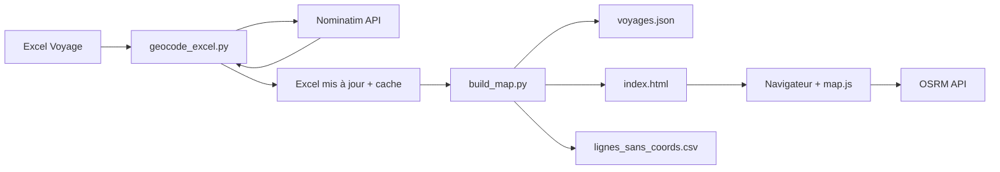

# CarteVoyage — Cahier des charges

**Version :** 1.0  
**Date :** 8 juin 2026  
**Projet :** CarteVoyage — Carte interactive de voyage à partir d'un fichier Excel

---

## Table des matières

1. [Présentation générale](#1-présentation-générale)
2. [Contexte et objectifs](#2-contexte-et-objectifs)
3. [Périmètre fonctionnel](#3-périmètre-fonctionnel)
4. [Acteurs et utilisateurs](#4-acteurs-et-utilisateurs)
5. [Source de données — Fichier Excel](#5-source-de-données--fichier-excel)
6. [Pipeline de traitement des données](#6-pipeline-de-traitement-des-données)
7. [Application web — Carte interactive](#7-application-web--carte-interactive)
8. [Modèle de données JSON](#8-modèle-de-données-json)
9. [Architecture technique](#9-architecture-technique)
10. [Structure du projet](#10-structure-du-projet)
11. [Guide d'utilisation](#11-guide-dutilisation)
12. [Critères d'acceptation](#12-critères-dacceptation)
13. [Contraintes, limites et risques](#13-contraintes-limites-et-risques)
14. [Évolutions envisageables](#14-évolutions-envisageables)

---

## 1. Présentation générale

**CarteVoyage** est un outil personnel de planification et de visualisation de voyages. Il transforme un fichier Excel de planning (activités, musées, balades, pauses…) en une **carte web interactive** affichant les points de visite géolocalisés, organisés par jour, avec possibilité de calculer les **trajets à pied** entre visites consécutives.

Le projet repose sur une chaîne simple :

```
Excel (source) → Scripts Python (géocodage + build) → JSON + HTML statique → Navigateur (Leaflet)
```

Il n'y a **pas de serveur applicatif** : le site web est entièrement statique et peut être ouvert localement ou hébergé sur n'importe quel hébergeur de fichiers statiques.

---

## 2. Contexte et objectifs

### 2.1 Contexte

L'utilisateur planifie un voyage (ex. : Amsterdam, 7 jours) dans un tableur Excel structuré par feuilles et colonnes. Il souhaite :

- Visualiser géographiquement l'ensemble des lieux à visiter ;
- Filtrer par jour pour se concentrer sur un itinéraire donné ;
- Estimer les déplacements à pied entre deux visites consécutives du même jour ;
- Consulter les informations pratiques (horaires, prix, billets, remarques) directement sur la carte.

### 2.2 Objectifs

| Objectif | Description |
|----------|-------------|
| **Centraliser** | Une seule source de vérité : le fichier Excel |
| **Automatiser** | Géocoder automatiquement les lieux sans saisie manuelle des coordonnées |
| **Visualiser** | Carte claire, numérotée, colorée par jour |
| **Naviguer** | Filtres par jour et sélection de trajets piétons |
| **Rester simple** | Pas de base de données, pas de backend, déploiement minimal |

### 2.3 Hors périmètre (v1)

- Édition en ligne du planning (lecture seule côté web)
- Authentification / multi-utilisateurs
- Application mobile native
- Calcul d'itinéraires multimodaux (transports en commun, vélo, voiture)
- Synchronisation temps réel avec Excel

---

## 3. Périmètre fonctionnel

### 3.1 Fonctionnalités — Scripts Python

#### F1 — Géocodage automatique (`geocode_excel.py`)

| ID | Exigence | Priorité |
|----|----------|----------|
| F1.1 | Lire toutes les feuilles d'activités du fichier Excel | Obligatoire |
| F1.2 | Créer automatiquement les colonnes `Ordre`, `Latitude`, `Longitude`, `Lien` si absentes | Obligatoire |
| F1.3 | Géocoder chaque lieu via l'API Nominatim (OpenStreetMap), pays par défaut : Pays-Bas (`nl`) | Obligatoire |
| F1.4 | Respecter un délai de 1,1 s entre requêtes (politique d'utilisation Nominatim) | Obligatoire |
| F1.5 | Utiliser un cache local (`data/geocode_cache.json`) pour éviter les requêtes redondantes | Obligatoire |
| F1.6 | Appliquer des alias de noms pour les lieux mal orthographiés ou ambigus | Obligatoire |
| F1.7 | Permettre des coordonnées manuelles pour certains lieux (`MANUAL_COORDS`) | Obligatoire |
| F1.8 | Pour les balades, utiliser la colonne `Remarque` comme requête de recherche prioritaire | Obligatoire |
| F1.9 | Ignorer les lignes déjà géocodées (sauf option `--force`) | Obligatoire |
| F1.10 | Créer une sauvegarde du fichier Excel avant modification (`excel/backups/`) | Obligatoire |
| F1.11 | Produire un rapport d'erreurs (`data/geocode_errors.csv`) | Obligatoire |
| F1.12 | Mode simulation `--dry-run` sans écriture dans Excel | Souhaité |

#### F2 — Génération de la carte (`build_map.py`)

| ID | Exigence | Priorité |
|----|----------|----------|
| F2.1 | Extraire les points ayant des coordonnées valides (Latitude + Longitude) | Obligatoire |
| F2.2 | Ignorer les lignes sans colonne `Ordre` valide (format `jour.visite`, ex. `3.5`) | Obligatoire |
| F2.3 | Générer `data/voyages.json` (données structurées) | Obligatoire |
| F2.4 | Générer `web/index.html` avec les données embarquées | Obligatoire |
| F2.5 | Produire un rapport des lignes sans coordonnées (`data/lignes_sans_coords.csv`) | Obligatoire |
| F2.6 | Attribuer une couleur par jour (palette cyclique de 10 couleurs) | Obligatoire |
| F2.7 | Inclure les métadonnées popup (Action, Type, Billet, Prix, City Card, horaires, Remarque) | Obligatoire |

### 3.2 Fonctionnalités — Application web

#### F3 — Carte principale (`web/index.html` + `map.js`)

| ID | Exigence | Priorité |
|----|----------|----------|
| F3.1 | Afficher une carte Leaflet avec tuiles OpenStreetMap | Obligatoire |
| F3.2 | Afficher un marqueur numéroté pour chaque point (`ordre_label`, ex. `3.5`) | Obligatoire |
| F3.3 | Colorer les marqueurs par jour | Obligatoire |
| F3.4 | Popup détaillée au clic : nom, jour/visite, action, type, horaires, prix, billet, city card, remarque, lien site | Obligatoire |
| F3.5 | Ajuster automatiquement le zoom pour englober tous les points visibles | Obligatoire |
| F3.6 | Filtre par jour (cases à cocher) | Obligatoire |
| F3.7 | Bouton « Tout afficher » pour réinitialiser les filtres | Obligatoire |
| F3.8 | Interface responsive (panneau filtres repliable sur mobile ≤ 768 px) | Obligatoire |

#### F4 — Trajets à pied

| ID | Exigence | Priorité |
|----|----------|----------|
| F4.1 | Lister les segments entre visites consécutives **du même jour** | Obligatoire |
| F4.2 | Permettre de cocher un ou plusieurs trajets à afficher sur la carte | Obligatoire |
| F4.3 | Calculer l'itinéraire piéton via OSRM (serveurs : `routing.openstreetmap.de` puis `router.project-osrm.org`) | Obligatoire |
| F4.4 | Afficher la distance (m) et la durée estimée (min) dans la popup du trajet | Obligatoire |
| F4.5 | Attribuer une couleur distincte à chaque trajet sélectionné | Obligatoire |
| F4.6 | Fallback en ligne droite pointillée si OSRM indisponible | Obligatoire |
| F4.7 | Mettre en cache les trajets calculés côté client | Obligatoire |
| F4.8 | Grouper les trajets par jour avec bouton « Tout cocher / Tout décocher » | Obligatoire |
| F4.9 | Bouton « Effacer les trajets » | Obligatoire |
| F4.10 | Désactiver automatiquement les trajets dont un point est masqué par le filtre jour | Obligatoire |

#### F5 — Pages par ville (évolution prévue)

Une page `web/villes/amsterdam.html` a existé avec une structure de données enrichie (`ville`, `onglet`, navigation entre pages), mais le JavaScript (`map.js`) ne gérait pas ces filtres ni `PAGE_FILTER` : la page était cassée et a été **supprimée**. Le support multi-villes reste une évolution prévue (voir §14).

---

## 4. Acteurs et utilisateurs

| Acteur | Rôle |
|--------|------|
| **Planificateur** | Maintient le fichier Excel, lance les scripts de géocodage et de build |
| **Voyageur** | Consulte la carte dans un navigateur (desktop ou mobile) pendant le voyage |
| **Services externes** | Nominatim (géocodage), OSRM (routage piéton), OpenStreetMap (tuiles carte) |

---

## 5. Source de données — Fichier Excel

### 5.1 Emplacement

- Dossier : `excel/`
- Fichier par défaut : `excel/Voyage Aout 2026.xlsx`
- Sauvegardes automatiques : `excel/backups/Voyage Aout 2026.backup.xlsx`

### 5.2 Structure des feuilles

| Type de feuille | Exemple | Traitement |
|-----------------|---------|------------|
| **Vue d'ensemble** | `Vue d'ensemble` | Ignorée (synthèse du voyage) |
| **Listes** | `Listes` | Ignorée (listes déroulantes) |
| **Jours** | `Jour 1`, `Jour 2`, … | Lues et traitées (activités du jour) |

Chaque feuille `Jour N` a une bannière en ligne 1, les en-têtes en ligne 2, les activités à partir de la ligne 3.

### 5.3 Colonnes requises et optionnelles

#### Colonnes métier (feuilles `Jour N`, ligne d'en-tête 2)

| Colonne Excel | Obligatoire | Description | Exemple |
|---------------|-------------|-------------|---------|
| `N° étape` | **Oui** | Jour et numéro de visite | `3.5`, `5.10` (format texte pour `.10`) |
| `Lieu` | **Oui** | Nom du lieu | Rijksmuseum |
| `Nature` | Non | Type d'activité | Visite, Transport, Hébergement |
| `Catégorie` | Non | Catégorie | Musée, Balade, Hôtel |
| `Quartier` | Non | Quartier (aide au géocodage des balades) | Jordaan |
| `Ville` | Non | Ville (détermine le pays pour le géocodage) | Amsterdam, Cologne |
| `Réservation` | Non | Réservation nécessaire | Oui / Non |
| `Prix (€)` | Non | Prix en euros | 25 |
| `Heure début` / `Heure fin` | Non | Horaires | 9h00 |
| `Site web` | Non | URL du site | https://… |

#### Colonnes carte (créées automatiquement si absentes)

| Colonne | Obligatoire | Description | Format |
|---------|-------------|-------------|--------|
| `Latitude` | **Oui** (pour apparaître sur la carte) | Latitude WGS84 | Décimal, ex. `52.3598431` |
| `Longitude` | **Oui** (pour apparaître sur la carte) | Longitude WGS84 | Décimal, ex. `4.8850395` |
| `Lien` | Non | URL prioritaire pour le popup (sinon `Site web`) | https://… |

### 5.4 Règles de parsing du `N° étape`

- Format attendu : `jour.visite` (ex. `6.5`, `3.10`)
- Le séparateur `.` ou `,` est accepté
- Saisir en **format texte** les étapes contenant `.10` pour éviter `5.10` → `5.1`
- Une ligne **sans `Lieu`** ou **sans `N° étape` valide** est ignorée
- Une ligne **sans coordonnées** est listée dans `lignes_sans_coords.csv` mais n'apparaît pas sur la carte

### 5.5 Exemple de lignes actuellement sans coordonnées

| Jour | Visite | Ordre | Nom |
|------|--------|-------|-----|
| 1 | 1 | 1.1 | cologne |
| 2 | 1 | 2.1 | cologne |
| 7 | 1 | 7.1 | Lille |

Ces lieux (hors Amsterdam / Pays-Bas) nécessitent un géocodage avec un pays adapté ou une saisie manuelle.

---

## 6. Pipeline de traitement des données

### 6.1 Schéma du flux



### 6.2 Script `geocode_excel.py`

**Rôle :** Remplir `Latitude` et `Longitude` dans le fichier Excel.

**Algorithme de recherche (par lieu) :**

1. Vérifier les coordonnées manuelles (`MANUAL_COORDS`)
2. Consulter le cache (`nom|remarque`)
3. Construire les requêtes :
   - Si `Action` = « balade » et `Remarque` renseignée → requête = remarque
   - Sinon → requête = nom (avec alias éventuel)
   - Puis → `nom, remarque` si remarque présente
4. Interroger Nominatim avec `countrycodes=nl`
5. Enregistrer le résultat dans le cache et dans Excel

**Alias configurés (exemples) :**

| Nom Excel | Requête Nominatim |
|-----------|-------------------|
| Het Bejinhof | Begijnhof Amsterdam |
| Risjkmuseum | Rijksmuseum Amsterdam |
| Rembrandhuis | Museum Rembrandthuis Amsterdam |
| Croisière sur les canaux | Amsterdam canal cruise |
| Tour A'DAM | A'DAM Lookout Amsterdam |

**Commandes :**

```bash
# Géocodage standard
python scripts/geocode_excel.py

# Fichier Excel personnalisé
python scripts/geocode_excel.py "excel/MonVoyage.xlsx"

# Simulation sans modification
python scripts/geocode_excel.py --dry-run

# Forcer le re-géocodage de toutes les lignes
python scripts/geocode_excel.py --force
```

**Fichiers produits :**

| Fichier | Contenu |
|---------|---------|
| `data/geocode_cache.json` | Cache des coordonnées trouvées |
| `data/geocode_errors.csv` | Lieux non trouvés |
| `excel/backups/*.backup.xlsx` | Sauvegarde avant écriture |

### 6.3 Script `build_map.py`

**Rôle :** Générer les artefacts web à partir de l'Excel géocodé.

**Commandes :**

```bash
python scripts/build_map.py
python scripts/build_map.py "excel/MonVoyage.xlsx"
```

**Fichiers produits :**

| Fichier | Contenu |
|---------|---------|
| `data/voyages.json` | Données structurées (jours + points) |
| `web/index.html` | Page HTML avec `window.VOYAGE_DATA` embarqué |
| `data/lignes_sans_coords.csv` | Activités sans Latitude/Longitude |

### 6.4 Workflow recommandé

```bash
# 1. Environnement Python
cd CarteVoyage
python -m venv .venv
.venv\Scripts\activate        # Windows
pip install -r scripts/requirements.txt

# 2. Placer le fichier Excel dans excel/

# 3. Géocoder
python scripts/geocode_excel.py

# 4. Corriger manuellement les erreurs dans Excel si nécessaire

# 5. Générer la carte
python scripts/build_map.py

# 6. Ouvrir la carte
start web/index.html          # Windows
```

---

## 7. Application web — Carte interactive

### 7.1 Technologies

| Composant | Technologie | Version |
|-----------|-------------|---------|
| Carte | Leaflet | 1.9.4 (CDN unpkg) |
| Tuiles | OpenStreetMap | — |
| Routage | OSRM (mode `foot`) | API publique |
| Styles | CSS custom (`map.css`) | — |
| Logique | JavaScript vanilla (`map.js`) | — |

### 7.2 Écrans

#### Page principale — `web/index.html`

- **En-tête** : titre « Carte du voyage », sous-titre « Points de visite par jour »
- **Panneau latéral gauche** (280 px) :
  - Filtres par jour
  - Section trajets à pied (liste par jour, cases à cocher, pastille de couleur)
  - Boutons « Effacer les trajets » et « Tout afficher »
- **Zone carte** : occupe le reste de l'écran

#### Pages par ville (évolution prévue, voir §14)

- Navigation : « Tout le voyage » / une page par ville
- Filtres prévus : villes, jours
- Données enrichies avec `ville` et `onglet` (quartiers)
- L'ancienne page `web/villes/amsterdam.html`, non fonctionnelle, a été supprimée

### 7.3 Comportement des marqueurs

- Label affiché : `ordre_label` (ex. `3.5`) ou `jour.visite`
- Couleur : palette fixe par numéro de jour (10 couleurs, cyclique)
- Clic → popup avec toutes les métadonnées disponibles
- Lien « Site web » si `lien` ou `Site` renseigné dans Excel

### 7.4 Comportement des trajets

- Un segment = liaison entre visite N et visite N+1 **du même jour**
- Calcul asynchrone avec indicateur de progression
- Délai de 120 ms entre requêtes OSRM successives
- Si la distance piétonne OSRM dépasse 2,5× la distance à vol d'oiseau (< 1,2 km), un avertissement est logué dans la console
- Le serveur OSRM DE est essayé en premier ; le serveur Project OSRM en secours
- Zoom automatique sur la sélection lors de l'activation d'un trajet unique

### 7.5 Responsive

- Viewport mobile pris en charge (`viewport-fit=cover`)
- Panneau filtres en `<details>` repliable
- Fermé par défaut sur écran ≤ 768 px
- `map.invalidateSize()` au redimensionnement et à l'ouverture/fermeture des filtres

---

## 8. Modèle de données JSON

### 8.1 Structure `voyages.json` (version actuelle)

```json
{
  "jours": [1, 2, 3, 4, 5, 6, 7],
  "points": [
    {
      "id": "3.1-2",
      "ordre": 1,
      "ordre_label": "3.1",
      "jour": 3,
      "visite": 1,
      "nom": "Les grands canaux",
      "lat": 52.3647238,
      "lon": 4.8969202,
      "lien": null,
      "couleur": "#3498db",
      "popup": {
        "action": "Balade",
        "type": "Balade",
        "billet": "Non",
        "prix": 0,
        "city_card": null,
        "ouverture": null,
        "fermeture": null,
        "remarque": "Singel, Herengracht…"
      }
    }
  ]
}
```

### 8.2 Description des champs

| Champ | Type | Description |
|-------|------|-------------|
| `jours` | `int[]` | Liste triée des numéros de jour présents |
| `points` | `object[]` | Tous les points géolocalisés |
| `points[].id` | `string` | Identifiant unique : `{ordre_label}-{numéro_ligne_excel}` |
| `points[].ordre` | `int` | Numéro de visite dans le jour |
| `points[].ordre_label` | `string` | Affichage : `jour.visite` |
| `points[].jour` | `int` | Numéro du jour de voyage |
| `points[].visite` | `int` | Rang de la visite ce jour-là |
| `points[].nom` | `string` | Nom du lieu |
| `points[].lat` / `lon` | `float` | Coordonnées WGS84 |
| `points[].lien` | `string\|null` | URL (colonne `Lien` ou `Site`) |
| `points[].couleur` | `string` | Code couleur hex du jour |
| `points[].popup` | `object` | Métadonnées affichées dans le popup |

### 8.3 Structure étendue (page Amsterdam — non intégrée au build actuel)

```json
{
  "villes": ["Amsterdam"],
  "onglets": ["Centre - Jordaan", "Vondelpark", "Est - Sud Est", "Nord"],
  "jours": { "3": ["Centre - Jordaan"], "4": ["Vondelpark"] },
  "points": [
    {
      "ville": "Amsterdam",
      "onglet": "Centre - Jordaan",
      "...": "..."
    }
  ]
}
```

---

## 9. Architecture technique

### 9.1 Stack

| Couche | Technologie |
|--------|-------------|
| Langage scripts | Python 3 |
| Lecture Excel | openpyxl ≥ 3.1.0 |
| HTTP (géocodage) | requests ≥ 2.31.0 |
| Frontend | HTML5, CSS3, JavaScript ES5 (IIFE) |
| Cartographie | Leaflet 1.9.4 |
| Géocodage | Nominatim (OpenStreetMap) |
| Routage | OSRM (profil piéton) |

### 9.2 Dépendances externes (réseau requis)

| Service | URL | Usage | Contrainte |
|---------|-----|-------|------------|
| Nominatim | `nominatim.openstreetmap.org` | Géocodage (scripts) | 1 req/s, User-Agent obligatoire |
| OSRM DE | `routing.openstreetmap.de` | Itinéraires piétons (navigateur) | Usage fair-use |
| OSRM Project | `router.project-osrm.org` | Secours routage | Usage fair-use |
| OSM Tiles | `tile.openstreetmap.org` | Fond de carte | Usage fair-use |
| Leaflet CDN | `unpkg.com/leaflet` | Bibliothèque carte | Connexion internet à l'ouverture |

### 9.3 Sécurité

- Pas de secrets dans le code
- Données personnelles de voyage stockées localement
- Échappement HTML systématique dans les popups (`escapeHtml`)
- Liens externes avec `rel="noopener"`

---

## 10. Structure du projet

```
CarteVoyage/
├── docs/
│   └── CAHIER_DES_CHARGES.md      # Ce document
├── excel/
│   ├── Voyage Aout 2026.xlsx      # Source (non versionnée ou locale)
│   └── backups/                   # Sauvegardes automatiques
├── data/
│   ├── voyages.json               # Données générées
│   ├── geocode_cache.json         # Cache géocodage
│   ├── geocode_errors.csv         # Erreurs de géocodage
│   └── lignes_sans_coords.csv     # Lignes sans coordonnées
├── scripts/
│   ├── excel_utils.py             # Bibliothèque partagée Excel/JSON
│   ├── geocode_excel.py           # Géocodage Nominatim
│   ├── build_map.py               # Génération HTML + JSON
│   └── requirements.txt           # Dépendances Python
├── web/
│   ├── index.html                 # Carte principale (générée)
│   └── assets/
│       ├── css/map.css            # Styles
│       └── js/map.js              # Logique carte + trajets
└── .venv/                         # Environnement virtuel Python
```

---

## 11. Guide d'utilisation

### 11.1 Préparer un nouveau voyage

1. Créer ou copier un fichier Excel dans `excel/`
2. Structurer les activités en feuilles `Jour 1`, `Jour 2`, … avec les colonnes du planning
3. Renseigner `Lieu`, `N° étape` (`jour.visite`) et `Ville` pour chaque activité
4. Adapter si besoin dans `geocode_excel.py` :
   - `COUNTRY_BY_VILLE` pour les villes du voyage
   - `NAME_ALIASES`, `NOM_ALIASES_BY_VILLE` et `MANUAL_COORDS` pour les lieux difficiles

### 11.2 Mettre à jour la carte après modification de l'Excel

```bash
python scripts/geocode_excel.py   # Si nouveaux lieux
python scripts/build_map.py       # Toujours après modification
```

### 11.3 Consulter la carte

- Ouvrir `web/index.html` dans un navigateur
- Cocher/décocher les jours pour filtrer
- Cocher des trajets pour voir les itinéraires piétons
- Cliquer sur les marqueurs pour les détails

### 11.4 Déployer en ligne

Copier le dossier `web/` (et éventuellement `data/voyages.json` si chargement externe futur) sur un hébergeur statique (GitHub Pages, Netlify, etc.). Une connexion internet est nécessaire pour les tuiles et le routage OSRM.

---

## 12. Critères d'acceptation

### Géocodage

- [ ] Toutes les lignes avec `Nom` + `Ordre` valide sont traitées
- [ ] Les lignes déjà géocodées ne sont pas écrasées (sauf `--force`)
- [ ] Une sauvegarde Excel est créée avant toute modification
- [ ] Les erreurs sont listées dans `geocode_errors.csv`
- [ ] Le cache évite les appels API redondants

### Build

- [ ] `voyages.json` contient tous les points avec coordonnées
- [ ] `index.html` s'ouvre sans serveur et affiche la carte
- [ ] Les lignes sans coords sont listées dans `lignes_sans_coords.csv`
- [ ] Les points sont triés par jour, visite, id

### Carte web

- [ ] Chaque point affiche son numéro `jour.visite`
- [ ] Les couleurs différencient les jours
- [ ] Le filtre jour masque/affiche les marqueurs et ajuste le zoom
- [ ] Les popups affichent les informations Excel disponibles
- [ ] Les trajets piétons s'affichent avec distance et durée
- [ ] Le fallback ligne droite fonctionne si OSRM est indisponible
- [ ] L'interface est utilisable sur mobile

---

## 13. Contraintes, limites et risques

| Contrainte / limite | Impact | Mitigation |
|---------------------|--------|------------|
| Géocodage limité au pays `nl` par défaut | Cologne, Lille non trouvés | Changer `DEFAULT_COUNTRY` ou saisie manuelle |
| Politique Nominatim (1 req/s) | Géocodage lent sur grands fichiers | Cache + alias + coords manuelles |
| APIs OSRM publiques | Indisponibilité ou résultats imprécis | Fallback ligne droite, double serveur |
| Données embarquées dans HTML | Regénération nécessaire à chaque changement | Relancer `build_map.py` |
| Pas de HTTPS local | Certaines APIs peuvent bloquer en `file://` | Servir via un serveur local simple |
| Orthographe des noms | Géocodage erroné | Alias dans `NAME_ALIASES` |
| Feuille `Amsterdam` ignorée | Confusion si activités y sont stockées | Utiliser des feuilles d'activités dédiées |
| Ordre `X.10` saisi comme nombre dans Excel | Devient `X.1` (collision de visite) | Saisir la colonne `Ordre` en texte ; `build_map.py` signale les collisions |

---

## 14. Évolutions envisageables

| Évolution | Description | Priorité suggérée |
|-----------|-------------|-------------------|
| Filtres ville / quartier | Finaliser le support `ville`, `onglet`, `PAGE_FILTER` dans `map.js` | Haute |
| Build multi-pages | Générer automatiquement `web/villes/*.html` depuis `build_map.py` | Haute |
| Géocodage multi-pays | Déduire le pays depuis la feuille Excel ou une colonne `Pays` | Haute |
| Chargement JSON externe | Charger `voyages.json` par fetch au lieu de l'embarquer | Moyenne |
| Export GPX / KML | Exporter l'itinéraire du jour | Moyenne |
| Serveur local intégré | Script `serve.py` pour éviter les problèmes `file://` | Moyenne |
| Regroupement par type | Filtre musées / balades / pauses | Basse |
| Mode hors-ligne | Tuiles et routage en cache local | Basse |
| Interface d'édition | Modifier le planning depuis la carte | Basse |

---

## Annexe A — Palette de couleurs par jour

| Jour (modulo 10) | Couleur |
|------------------|---------|
| 1 | `#e74c3c` |
| 2 | `#27ae60` |
| 3 | `#3498db` |
| 4 | `#9b59b6` |
| 5 | `#e67e22` |
| 6 | `#1abc9c` |
| 7 | `#f39c12` |
| 8 | `#2c3e50` |
| 9 | `#d35400` |
| 10 | `#16a085` |

---

## Annexe B — Dépendances Python

```
openpyxl>=3.1.0
requests>=2.31.0
```

---

## Annexe C — Glossaire

| Terme | Définition |
|-------|------------|
| **Jour** | Numéro du jour de voyage (colonne `Ordre`, partie entière) |
| **Visite** | Rang de l'activité dans la journée (colonne `Ordre`, partie décimale) |
| **Segment** | Trajet entre deux visites consécutives du même jour |
| **Géocodage** | Conversion d'un nom de lieu en coordonnées GPS |
| **Nominatim** | Service de géocodage d'OpenStreetMap |
| **OSRM** | Open Source Routing Machine — calcul d'itinéraires |
| **City Card** | Pass touristique (ex. Amsterdam City Card) |

---

*Document généré à partir de l'analyse du code source du projet CarteVoyage (juin 2026).*
